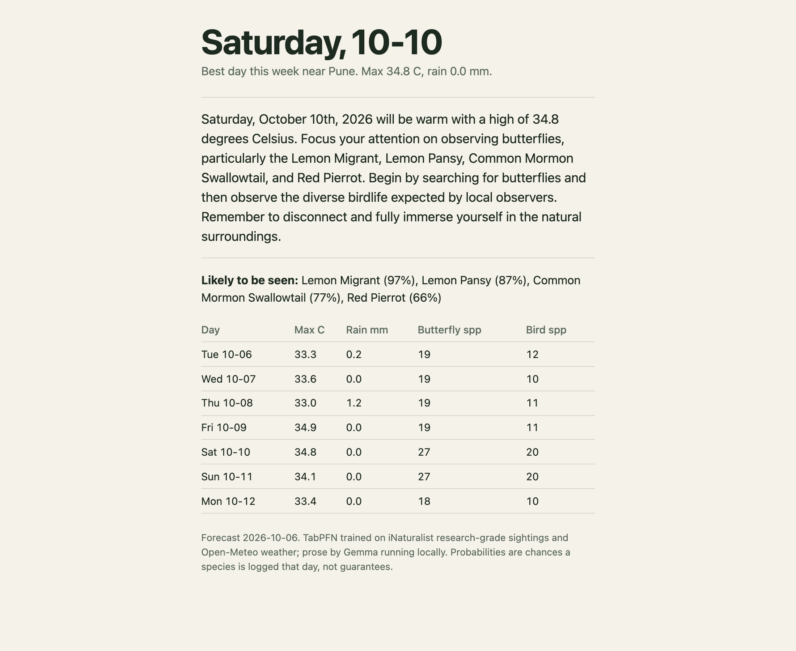
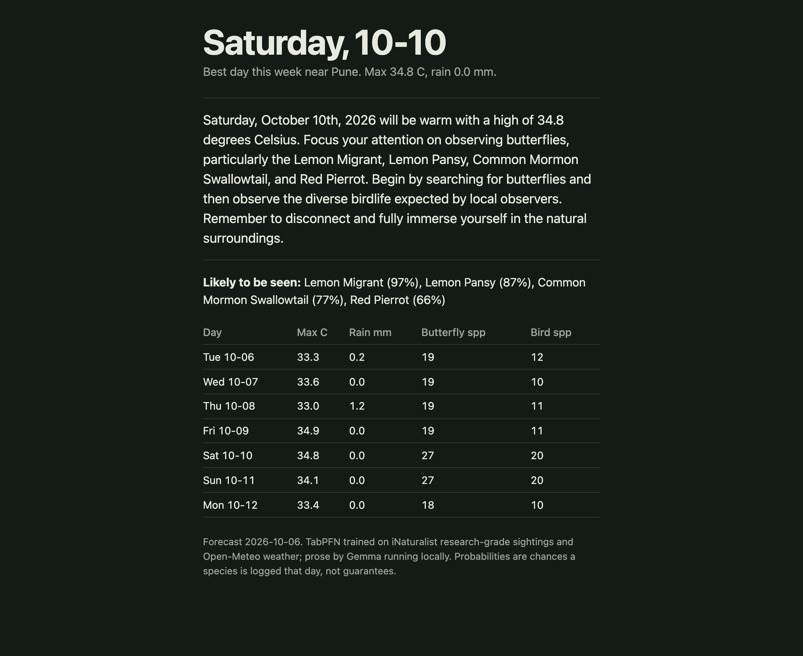
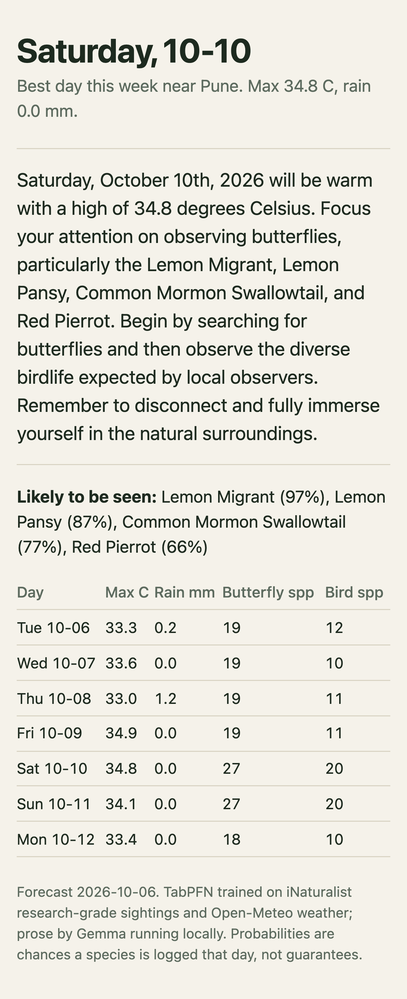
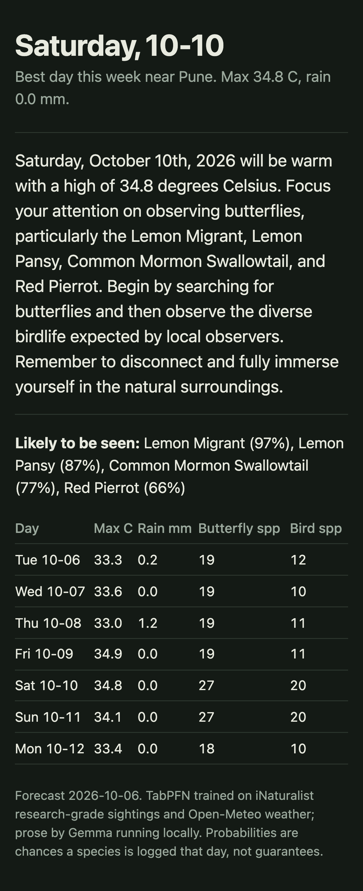
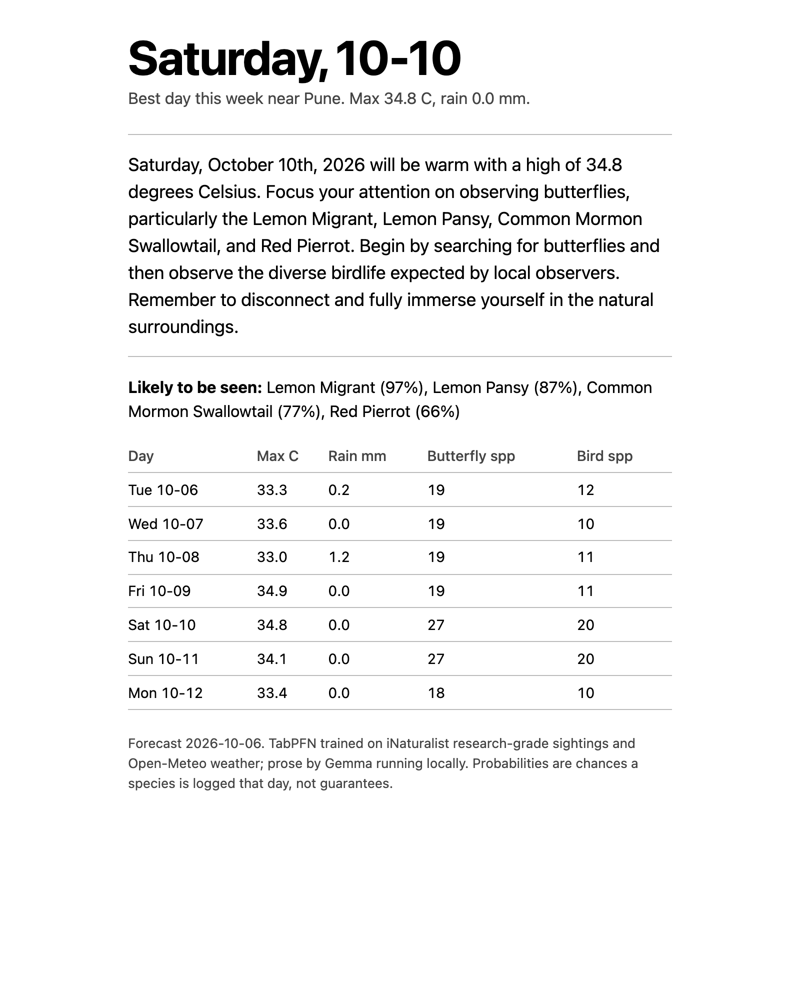
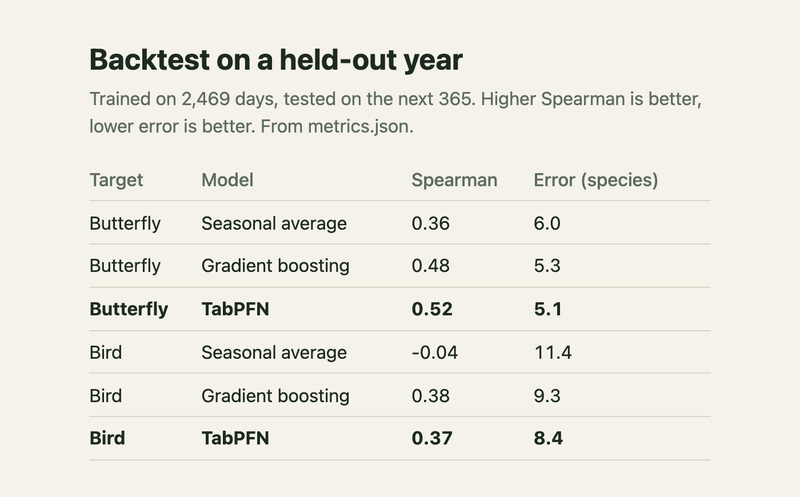

# Fieldcast

Which day this week is best to go outside near Pune, and what will you probably see. TabPFN forecasts daily butterfly and bird species counts from weather and calendar. Local Gemma writes a one-page printable card.

```
python3.11 -m venv .venv && .venv/bin/pip install -r requirements.txt
brew install ollama && ollama serve & ollama pull gemma3:4b
.venv/bin/python fetch.py                                  # iNaturalist + Open-Meteo, about 20 min
TABPFN_ALLOW_CPU_LARGE_DATASET=1 .venv/bin/python model.py backtest   # about 10 min, writes metrics.json
TABPFN_ALLOW_CPU_LARGE_DATASET=1 .venv/bin/python model.py forecast   # about 9 min, writes forecast.json
.venv/bin/python card.py                                   # writes card.html
```

## Screenshots

The card follows the system theme and prints on one page.

| Desktop, light | Desktop, dark |
|---|---|
|  |  |

| Phone, light | Phone, dark | Printed |
|---|---|---|
|  |  |  |

Backtest on a held-out year (from `metrics.json`):



Uses the open TabPFN v2 weights (`Prior-Labs/TabPFN-v2-reg`, `TabPFN-v2-clf`). Change `LAT`, `LNG` in `fetch.py` and `model.py` for another place.

Data: iNaturalist research-grade observations (each observer's own licence applies, aggregated here as daily counts only) and Open-Meteo weather.
